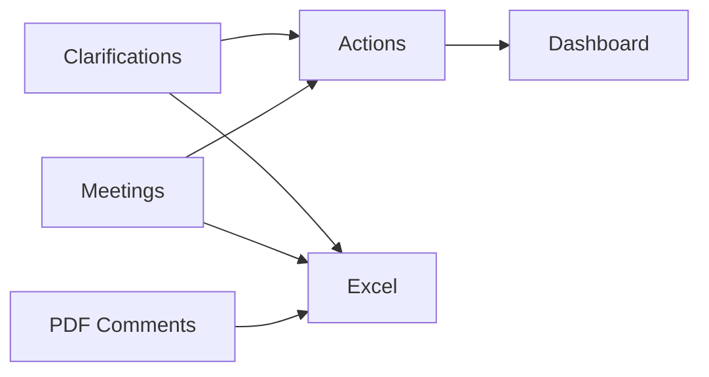
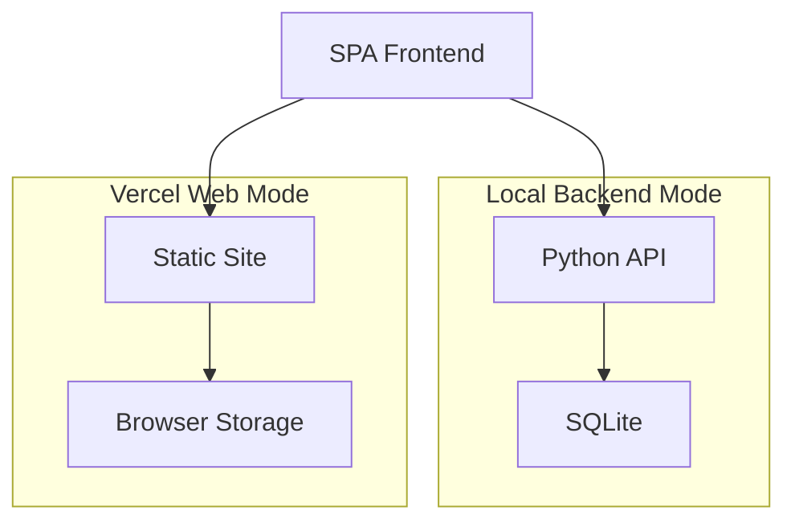
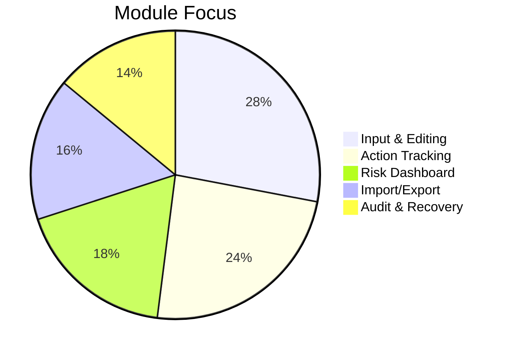

# Clarification Action Tracker System

个人工程记录与行动追踪工具，面向 FLNG/FPSO EPC 设备采购设计阶段。

## Readme 导航

- 中文完整版：`README.zh-CN.md`
- English version: `README.en.md`

## 一句话亮点

- 业务闭环：澄清/会议录入 -> 行动聚合 -> 仪表盘风险追踪 -> Excel 导入导出
- 轻量架构：Vanilla JS + Python + SQLite，低运维成本
- 双运行模式：本地强制后端模式（生产） + Vercel 网页模式（演示）

## 系统可视化速览







## 快速开始

- 本地后端模式（推荐）：`quick-start.bat --serve 5500`
- Vercel 网页模式：部署后访问 `https://<your-project>.vercel.app/?mode=web`

### Vercel 直接部署

1. Vercel 控制台选择 Add New Project。
2. 导入仓库：XFKI/3.-Clarification_action_tracker_system。
3. Framework 选择 Other，Build Command 留空。
4. 部署完成后访问：你的域名 + ?mode=web。

CLI 方式：

- 登录：npx vercel login
- 部署：npx vercel --prod --yes
- 若报 token 无效：重新登录或更新 token。

## 技术栈（简版）

- Frontend: HTML5, CSS3, Vanilla JavaScript
- Data/Charts: SheetJS, Chart.js
- Backend: Python http.server
- Storage: SQLite (local backend mode)
- Deployment: Vercel Static Hosting (web demo mode)

## 技术栈（工程化视角）

| Layer | Choice | Why |
| --- | --- | --- |
| UI/Interaction | Vanilla JS | 低依赖、部署轻、可离线 |
| Visualization | Chart.js | 快速表达工程 KPI 与风险趋势 |
| Data Exchange | SheetJS | 与工程常用 Excel 工作流无缝衔接 |
| Local API | Python http.server | 脚本化启动简单，适合内网环境 |
| Persistence | SQLite | 单文件数据库，备份/迁移友好 |
| PDF Mining | PyMuPDF | 工程批注抽取稳定 |
| Web Delivery | Vercel | 受限办公终端下可在线访问 |

---

以下为历史详细说明（保留）。

本工具重点解决四件事：

- 快速录入：把澄清与会议记录结构化
- 快速跟踪：自动聚合未关闭项并暴露逾期风险
- 快速闭环：在行动视图直接推进并回写源记录
- 快速复盘：可视化统计与 Excel 导入导出

## 1. 项目定位与边界

- 技术形态：纯前端单页应用（SPA），无后端依赖，可离线使用
- 目标用户：FLNG/FPSO EPC 采购设计场景下的动设备工程师
- 核心流程（不可破坏）：
  - 澄清/会议录入
  - 行动项聚合
  - 仪表盘统计
  - Excel 导入导出

## 2. 真实运行口径（基于当前代码）

## 2.1 实际加载文件

- 入口页：`index.html`
- 实际运行脚本：`assets/js/app.core.js` + `assets/js/app.features.js`
- 样式：`assets/css/styles.css`

## 2.2 主数据语义

- Clarifications：主问题池之一
- Meetings：主问题池之一
- Actions：由未关闭事项聚合得到的执行视图，不是独立主数据

## 2.3 状态字典

当前 UI 可见状态：`OPEN` / `IN_PROGRESS` / `INFO` / `CLOSED`

- `CLOSE`、`IN PROGRESS` 等历史值会自动归一化
- Actions 聚合未关闭项：`OPEN` + `IN_PROGRESS`（`INFO` 不计入待关闭）
- 优化建议口径（长期）：逐步收敛为 `OPEN / IN_PROGRESS / CLOSED`，`INFO` 作为过渡态可后续策略化处理

## 2.4 日期口径

- Clarification 到期：`currentDueDate`
- Meeting 到期：`plannedDate`
- Meeting 目录筛选：`meetingDate`

## 3. 已实现能力清单

## 3.1 录入与维护效率

- 多项目管理：新增、切换、重命名、删除
- 行内编辑：新增、保存、取消、删除
- 批量操作：批量改状态、批量删除
- 批量字段更新：支持责任方、日期、优先级、状态批量更新，并提供变更预览确认
- 一键关闭：支持在源表与 Actions 视图快速关闭
- 键盘快捷操作：`Ctrl+N` 新建、`Ctrl+S` 保存、`Ctrl+Shift+X` 快速关闭、`Alt+1~5` 切换标签
- 字典管理：专业/类型/责任方/来源可在编辑中直接新增与删除
- 必填校验：保存时拦截关键字段缺失
- PDF意见独立看板：导入 PDF 后自动抽取批注文本，独立导出 Excel（与文件管理看板解耦）

说明（临时变更）：文件管理看板已暂时下线，不影响澄清/会议/行动/仪表盘/PDF意见看板使用。

## 3.2 跟踪与风险暴露

- Actions 自动聚合未关闭项并支持回写
- 逾期筛选、疑似重复筛选（澄清视图）
- 仪表盘 KPI：总量、待处理、逾期、关闭率、7天内到期、高优先级未关闭
- 统计图：状态、专业、责任方、优先级、7天新增/关闭趋势
- 负荷视图：责任方 + 到期周
- 风险排名：责任方风险分（未关闭/逾期/高优先级）
- 组合风险看板：逾期 + 高优先级 + 责任方
- 责任方负荷阈值：未关闭项 >8 时高亮，便于快速识别超负荷责任方

## 3.3 追溯与数据安全

- 审计字段：`createdAt` / `updatedAt` / `updatedBy`
- 历史记录：创建、状态变化、回复变化、编辑、附件变化
- 回收站：删除后可恢复；支持清空
- 当前项目清空：后端事务化执行，条目迁移到回收站（可恢复），前端只触发一次刷新
- 全缓存清空：后端事务化执行并触发 SQLite `VACUUM`，数据库文件大小可回收

## 3.4 附件与存储

- 浏览器本地模式：附件优先写入 IndexedDB，主数据存 localStorage
- 强制后端模式（当前默认）：意见与附件写入项目目录 SQLite（`data/tracker.db`）；浏览器仅保留轻量界面配置缓存，不再承载主业务数据
- 旧版内嵌附件自动迁移到 IndexedDB
- 状态同步：后端字段级增量 Patch API（不再每次整包提交状态）
- 存储分析面板：强制后端模式下直接读取后端统计（结构化数据、附件总量、数据库文件大小）

## 3.5 体验增强

- 中英文切换、浅色/夜班主题切换
- 首次透明引导卡 + 使用说明弹窗
- 表格列宽可拖拽并按项目记忆，支持单表重置
- 全界面响应式（桌面/平板/手机）

## 3.6 文件管理看板（临时下线）

- 当前版本已暂时移除该看板入口与交互
- 相关业务功能后续可按需求重新启用

## 3.7 PDF意见看板（独立）

- 批量导入 PDF：自动提取注释/批注文本
- 强制后端模式下，前端导入PDF会优先调用后端 PyMuPDF 提取，结果与离线脚本口径一致
- 文件管理导入与后端映射索引时，PDF意见可同步沉淀到独立意见看板
- 清单展示：包含文件名、页码、注释人、时间、注释类型、序号、意见内容
- 文件筛选：可按单个文件查看批量导入结果
- 选择导出：支持勾选部分意见导出，未勾选时默认导出全部
- Excel导出：导出为独立意见清单（`.xlsx`）

说明：PDF 注释提取采用通用规则解析，复杂批注格式建议人工复核。

离线批量提取脚本（PyMuPDF + pandas）：

- 脚本路径：`backend/extract_pdf_comments.py`
- 安装依赖：`pip install pymupdf pandas openpyxl`
- 提取单个PDF：`python backend/extract_pdf_comments.py --input "sample.pdf" --output "sample_comments.xlsx"`
- 提取文件夹全部PDF：`python backend/extract_pdf_comments.py --input "深井泵VD" --output "deepwell_comments.xlsx"`

## 4. 数据模型（当前实现）

SDR导入口径（文件管理看板）：

- 当前随文件管理看板一并临时下线

## 4.1 Clarifications

- `actionId`
- `priority`
- `discipline`
- `type`
- `source`
- `clarification`
- `reply`
- `actionBy`
- `openDate`
- `currentDueDate`
- `completionDate`
- `status`
- `createdAt` / `updatedAt` / `updatedBy`
- `history`
- `fieldAttachments`

## 4.2 Meetings

- `no`
- `priority`
- `subject`
- `discipline`
- `clarification`
- `reply`
- `actionBy`
- `meetingDate`
- `plannedDate`
- `completionDate`
- `status`
- `createdAt` / `updatedAt` / `updatedBy`
- `history`
- `fieldAttachments`

## 5. 快速启动

## 5.1 直接打开

1. 双击 `index.html` 或执行：

```bat
quick-start.bat
```

## 5.2 本地后端数据库模式（推荐）

- Windows：

```bat
quick-start.bat --serve 5500
```

- Linux/macOS：

```bash
sh quick-start.sh 5500
```

说明：脚本会自动在后台启动 `backend/server.py`，并把数据落在 `data/tracker.db`，启动后可直接关闭终端窗口（无需一直挂着）。本版本为强制后端模式：未检测到后端时主界面会阻断进入，不再使用浏览器本地兜底存储。

自动停服：当主界面全部关闭后，后端会在短时间空闲后自动退出，无需手动执行停止脚本。

停止后台后端：

```bat
quick-stop.bat 5500
```

```bash
sh quick-stop.sh 5500
```

可显式使用文件直开模式：

```bash
sh quick-start.sh --file
```

## 5.3 新同事 3 分钟上手

1. 先选项目或新建项目：确认当前项目名正确。

1. 录入两类源问题：

- 技术问题录入“技术澄清”
- 会议行动录入“会议纪要”

1. 每天优先看“行动项”：按“逾期 -> HIGH -> 7天内到期”顺序推进。

1. 闭环规则：状态仅使用 `OPEN / IN_PROGRESS / CLOSED`，关闭后会自动回写源条目。

1. 对外沟通前导出 Excel，执行清空前先导出备份。

常用快捷键：`Ctrl+N` 新建、`Ctrl+S` 保存、`Ctrl+Shift+X` 快速关闭当前行、`Alt+1~5` 切换标签页。

## 5.3 快速打包下载

```bash
sh quick-download.sh 5610
```

脚本会生成 zip 并提供本地下载链接。

## 6. 推荐工作流（工程场景）

1. 在 Clarifications/Meetings 录入或导入 Excel。
2. 每日优先处理 Actions（建议顺序：逾期 > HIGH > 7天内到期）。
3. 在 Dashboard 查看责任方风险与周负荷。
4. 每周导出 Excel 归档，必要时清理大附件。

## 7. 导入导出口径

## 7.1 导入

- 自动识别澄清/会议表
- 支持中英文字段映射
- 支持 `meeting date/会议日期`、`planned/计划日期` 等常见列名

## 7.2 导出

- 按“技术澄清 / 会议纪要”分 sheet 导出
- 当前导出口径以业务字段为主，便于对外沟通

## 8. 开发与迭代约束

- 保持轻量、离线、可回滚
- 新功能必须直接提升录入/跟踪/闭环/复盘之一
- 涉及状态或日期语义改动，必须同步说明统计口径影响
- 导入导出字段映射必须可解释

## 9. 下一步改进方向（面向界面与功能）

按优先级推进，避免发散：

1. 数据一致性：将 `INFO` 明确为“信息记录态（不计入待关闭）”或映射到 `IN_PROGRESS`（二选一并全局统一）；新增日期校验（`plannedDate` 不早于 `meetingDate`、到期日不早于开始日），保存时阻断并提示。
1. 处理效率：增加键盘快捷操作（新建、保存、快速关闭、切换标签页）；新增批量字段更新（责任方、到期日、优先级），并保留批量前后差异提示，减少误操作。
1. 风险暴露：新增“逾期 + 高优先级 + 责任方”组合看板与筛选预设；为责任方负荷增加阈值标识（如 >8 项/周标红），支持一键跳转到对应明细。
1. 追溯复盘：增加关闭周期分布与解释性统计；为历史日志提供结构化过滤。

## 10. 目录结构

```text
index.html
assets/
  css/styles.css
  js/app.core.js
  js/app.features.js
backend/
  server.py
data/
  tracker.db           # 启动后自动创建
quick-start.bat
quick-start.sh
quick-stop.bat
quick-stop.sh
quick-download.sh
README.md
```

## 11. 参考资料

- `F450 GENTING FLNG -Clarification List-Action list weekly 20240826 BH.xlsx`
- `.github/copilot-instructions.md`

## 12. 验证清单（文档更新后建议执行）

1. 语法检查：

```bash
node --check assets/js/app.core.js
node --check assets/js/app.features.js
```

1. 关键流程回归：澄清/会议新增、编辑、删除、批量操作可用；Actions 关闭可回写源记录；Dashboard 指标与图表正常。
1. 导入导出回归：导入含 `meeting date/会议日期` 文件正常；导出 Excel 字段与业务预期一致。
1. 存储回归：上传大附件成功；存储面板可读取后端统计；执行“一键清空”后 `data/tracker.db` 文件大小下降。

## 13. 免责声明

当前版本为本地单机工具，不包含服务端备份、权限控制和多端协同。
