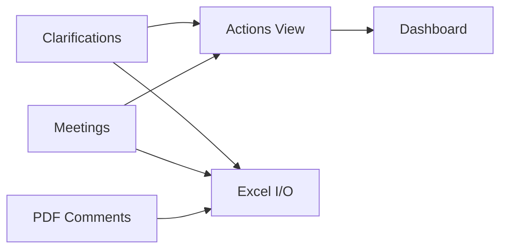
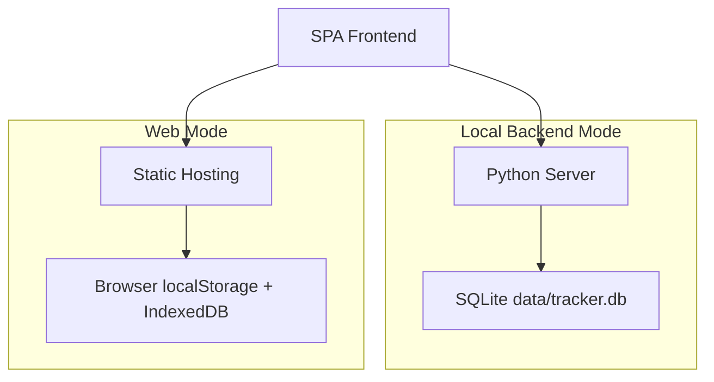

# Clarification Action Tracker System

[](./index.html)
[](./README.md#runtime-modes)
[](./README.md#architecture-at-a-glance)
[](./README.md)

A lightweight engineering tracker for FLNG/FPSO EPC procurement design.
It turns clarification and meeting records into actionable follow-up items, risk visibility, and export-ready reports.

## Language

- English (primary): this file
- Chinese (companion): [README.zh-CN.md](README.zh-CN.md)

## Why This Exists

- Faster intake: structured Clarification and Meeting records
- Faster tracking: auto-aggregated open Actions with due/overdue visibility
- Faster closure: one-place status push and source writeback
- Faster review: dashboard KPIs + Excel import/export

## Architecture At A Glance





## Tech Stack

| Layer | Choice | Why It Helps |
| --- | --- | --- |
| Frontend | HTML5 + CSS3 + Vanilla JavaScript | Fast, portable, no framework overhead |
| Visualization | Chart.js | Clear KPI and trend charts |
| Excel I/O | SheetJS (xlsx) | Fits common engineering handover format |
| Local Backend | Python http.server | Easy startup in restricted enterprise PCs |
| Persistence | SQLite | Single-file local reliability |
| PDF Extraction | PyMuPDF | Practical comment extraction workflow |
| Deployment | Vercel / GitHub Pages | Quick online demo and sharing |

## Runtime Modes

### Local Backend Mode (recommended for daily work)

- Uses local SQLite for structured data and attachments
- Start on Windows:

```bat
quick-start.bat --serve 5500
```

- Start on Linux/macOS:

```bash
sh quick-start.sh 5500
```

### Web Mode (recommended for demos)

- No local Python process required
- URL example:

```text
https://<your-domain>/?mode=web
```

- Data is browser-scoped, so keep periodic exports/backups

## Core Workflow

1. Log source issues in Clarifications and Meetings.
2. Work from Actions (overdue -> high priority -> due soon).
3. Use Dashboard for owner load and closure trend.
4. Export Excel for handover and archival.

## Key Features

- Structured records for Clarifications and Meetings
- Auto-generated Actions board for open items
- Batch updates (status, owner, dates, priority)
- Risk visibility (overdue, high-priority, owner load)
- Audit metadata and history traces
- Recycle and restore support
- Independent PDF comments board
- Scheduled/Manual backup options for safer web-mode usage

## UI Preview

> Place the 3 screenshots in [docs/screenshots](docs/screenshots) with the exact filenames below.

### 1) English Dashboard


### 2) Chinese Dashboard


### 3) Actions Board


## Project Structure

```text
index.html
assets/
  css/styles.css
  js/app.core.js
  js/app.features.js
backend/
data/
docs/
  screenshots/
README.md
README.zh-CN.md
```

## Deployment

### Vercel

1. Import repository in Vercel.
2. Select framework: Other.
3. Keep build command empty.
4. Deploy from root and open with ?mode=web.

### GitHub Pages

- Use repository workflow in [.github/workflows/github-pages-deploy.yml](.github/workflows/github-pages-deploy.yml)
- Open deployed URL with ?mode=web

## Validation Checklist

- App starts in local backend mode
- App starts in web mode with ?mode=web
- Clarification/Meeting -> Action aggregation works
- Dashboard KPI/charts render correctly
- Excel import/export works
- Backup action works in target browser

## Notes

- Document management board is temporarily disabled and does not block core workflow.
- Current status values in use: OPEN / IN_PROGRESS / INFO / CLOSED.
- Long-term normalization target remains OPEN / IN_PROGRESS / CLOSED.
