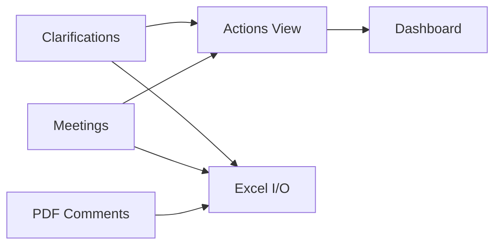
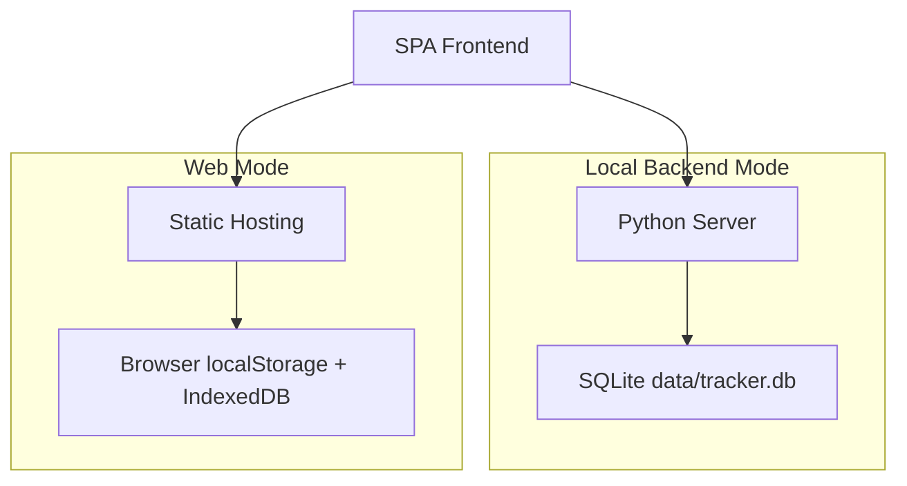

<div align="center">

# Clarification Action Tracker System

**Engineering Closure Tracker (formerly Clarification & Action Tracker) · FLNG/FPSO EPC**

[](README.md)
[](README.zh-CN.md)

[](https://vercel.com/new/clone?repository-url=https://github.com/XFKI/3.-Clarification_action_tracker_system)
[](https://github.com/XFKI/3.-Clarification_action_tracker_system/actions/workflows/github-pages-deploy.yml)


</div>

A lightweight engineering tracker for FLNG/FPSO EPC procurement design.
It converts clarification and meeting records into actionable tasks, risk visibility, and export-ready reporting.

---

## Highlights

| Module | Value |
| --- | --- |
| Structured Input | Clarification/Meeting records with inline edit and validation |
| Action Aggregation | Auto-build open actions and support source writeback |
| Risk Exposure | Overdue, high-priority, owner workload, due-soon |
| Dashboard | KPI cards + Chart.js trend views |
| Excel I/O | SheetJS import/export for engineering handover |
| PDF Comments | Extract only real text comments, then review and export |
| Auditability | Change history + recycle/restore |

## Tech Stack

### Stack Icons

- 🌐 Frontend: HTML5 + CSS3 + Vanilla JavaScript (ES6)
- 📈 Visualization: Chart.js
- 📄 Excel Engine: SheetJS (xlsx)
- 🐍 Local API: Python 3 + http.server
- 🗄️ Storage: SQLite
- 🧾 PDF Mining: PyMuPDF
- 🚀 Hosting: Vercel + GitHub Pages

### Stack Map

| Layer | Technology | Role |
| --- | --- | --- |
| UI | Vanilla JS, HTML5, CSS3 | Lightweight SPA interaction |
| Charts | Chart.js | KPI and trend visualization |
| Data Exchange | SheetJS | Excel import and export |
| Local Service | Python http.server | Local backend endpoints |
| Persistence | SQLite | Reliable single-file storage |
| PDF Extraction | PyMuPDF | PDF comment parsing |
| Web Delivery | Vercel, GitHub Pages | Online demo deployment |

## Architecture





## Runtime Modes

### 1) Local Backend Mode (recommended)

```bat
quick-start.bat --serve 5500
```

```bat
quick-start.bat --diagnose --serve 5500
```

- Data and attachments are persisted in local SQLite.
- `--diagnose` keeps a visible backend console and writes startup logs to `logs/backend-start-*.log`.
- Startup now performs `/api/health` verification and prints actionable hints for:
  - port occupied by another process
  - missing Python runtime
  - process launch blocked by endpoint policy
- Stop backend:

```bat
quick-stop.bat 5500
```

### Local Backup and Portable Package

```bat
quick-backup-db.bat
```

```bat
quick-portable-package.bat
```

- `quick-backup-db.bat`: one-click backup of `data/tracker.db` to `portable-backups/`.
- `quick-portable-package.bat`: creates a standardized portable ZIP under `portable-package/` using a temporary staging folder (no persistent project mirror is left in the workspace).
- By default, `.venv` is skipped for cross-machine compatibility. Use `--with-venv` only for same-machine use.
- Optional debug flag: `--keep-stage` keeps the temporary staging folder after packaging.
- Migration rule: **copy database file**.
  - Source: `data/tracker.db` (or `portable-backups/tracker-*.db`)
  - Target: replace `data/tracker.db` on the destination machine

### Python EXE One-Click Package

```bat
build-pythonexe.bat
```

```bat
quick-package-exe.bat
```

- `build-pythonexe.bat`: builds `dist/ClarificationActionTracker.exe` via PyInstaller.
- `quick-package-exe.bat`: builds and zips a single-run package under `portable-package/ClarificationActionTracker-EXE-*.zip`.

### 2) Web Mode (Vercel / GitHub Pages)

- Vercel URL:

```text
https://<your-domain>.vercel.app/?mode=web
```

- GitHub Pages URL:

```text
https://xfki.github.io/3.-Clarification_action_tracker_system/
```

- Browser storage is used in web mode, suitable for demo/restricted devices.

## Deployment

### One-Click Deploy

[](https://vercel.com/new/clone?repository-url=https://github.com/XFKI/3.-Clarification_action_tracker_system)
[](https://github.com/XFKI/3.-Clarification_action_tracker_system/actions/workflows/github-pages-deploy.yml)

### Manual Notes

1. Vercel: Framework = Other, Build command empty.
2. GitHub Pages: run `.github/workflows/github-pages-deploy.yml`.
3. For Vercel demo, append `?mode=web` if needed.

## UI Preview

### 1) English Dashboard


### 2) Chinese Dashboard


### 3) Actions Board


## Quick Workflow

1. Input new records in Clarifications/Meetings.
2. Work from Actions: overdue -> high-priority -> due soon.
3. Review owner risks in Dashboard.
4. Export Excel for weekly handover/archive.

## 90-Second Onboarding

1. Start from Overview to check cross-project risks.
2. Sidebar now shows package lists for all projects by default for quick comparison.
3. Put technical questions in Clarifications and meeting tasks in Meetings.
4. In Actions, prioritize Overdue + High priority items first.
5. Run Backup Now before end-of-day handover.

## BI-Style Dashboard Guidance

1. Data-entry standards:
  - Keep status dictionary centered on `OPEN / IN_PROGRESS / CLOSED`.
  - Fill owner, priority, and due date whenever possible.
2. Closure quality metrics:
  - Scope: Clarification + Meeting records.
  - Core KPIs: <=7-day close rate, average close days, close rate by source.
3. Risk exposure metrics:
  - Owner risk score = open + 2 x overdue + 2 x high priority.
  - Add due-week workload Top N for weekly planning and balancing.
4. Display split:
  - Overview for fast decisions (dense KPI + Top tables).
  - Dashboard for trend analysis (aging buckets, 7-day trend, source efficiency).

## Project Structure

```text
index.html
assets/
  css/styles.css
  js/app.core.js
  js/app.features.js
backend/
data/
docs/
  screenshots/
README.md
README.zh-CN.md
```

## Notes

- Document management board is temporarily disabled and does not block core workflow.
- Current status values: OPEN / IN_PROGRESS / INFO / CLOSED.
- Long-term normalization target: OPEN / IN_PROGRESS / CLOSED.
