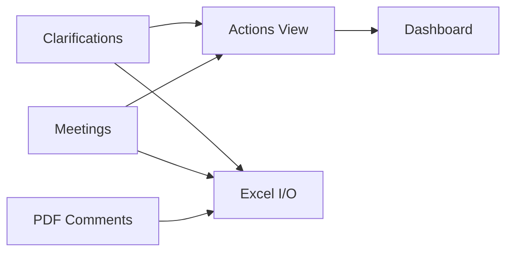
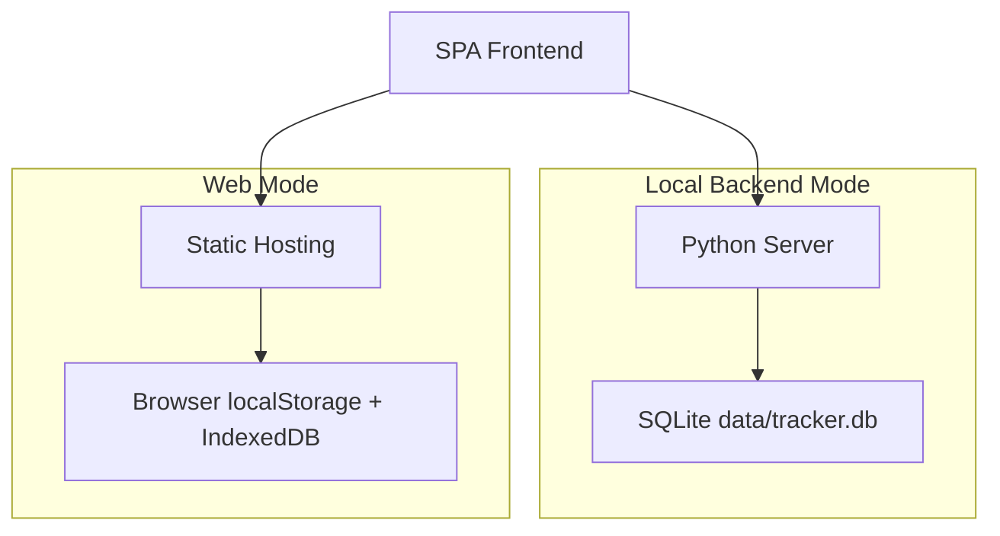

<div align="center">

# Clarification Action Tracker System

**工程澄清与行动追踪系统 · FLNG/FPSO EPC**

[](README.md)
[](README.zh-CN.md)

[](https://vercel.com/new/clone?repository-url=https://github.com/XFKI/3.-Clarification_action_tracker_system)
[](https://github.com/XFKI/3.-Clarification_action_tracker_system/actions/workflows/github-pages-deploy.yml)


</div>

面向 FLNG/FPSO EPC 采购设计阶段的轻量工程效率工具。
将技术澄清与会议记录转化为可执行行动、风险可视化与可导出汇报数据。

---

## 核心能力

| 模块 | 价值 |
| --- | --- |
| 结构化录入 | 澄清/会议行内编辑与关键字段校验 |
| 行动聚合 | 自动汇总未关闭项并支持回写源记录 |
| 风险暴露 | 逾期、高优先级、责任方负荷、临近到期 |
| 仪表盘 | KPI 卡片 + Chart.js 趋势图 |
| Excel I/O | SheetJS 双向导入导出 |
| PDF 意见 | PDF 批注提取、筛选、导出 |
| 审计追踪 | 变更历史 + 回收站恢复 |

## 技术栈

### 技术图标速览

- 🌐 前端：HTML5 + CSS3 + Vanilla JavaScript (ES6)
- 📈 可视化：Chart.js
- 📄 Excel 引擎：SheetJS (xlsx)
- 🐍 本地服务：Python 3 + http.server
- 🗄️ 数据存储：SQLite
- 🧾 PDF 提取：PyMuPDF
- 🚀 在线部署：Vercel + GitHub Pages

### 技术分层

| 层级 | 技术 | 作用 |
| --- | --- | --- |
| UI | Vanilla JS, HTML5, CSS3 | 轻量 SPA 交互 |
| 图表 | Chart.js | KPI 与趋势可视化 |
| 数据交换 | SheetJS | Excel 导入导出 |
| 本地服务 | Python http.server | 本地后端接口 |
| 持久化 | SQLite | 单文件可靠存储 |
| PDF 提取 | PyMuPDF | PDF 批注解析 |
| 在线交付 | Vercel, GitHub Pages | 在线演示部署 |

## 系统架构





## 运行模式

### 1) 本地后端模式（推荐）

```bat
quick-start.bat --serve 5500
```

```bash
sh quick-start.sh 5500
```

- 数据与附件写入本机 SQLite。
- 停止后端：

```bat
quick-stop.bat 5500
```

### 2) 网页模式（Vercel / GitHub Pages）

- Vercel 访问：

```text
https://<your-domain>.vercel.app/?mode=web
```

- GitHub Pages 访问：

```text
https://xfki.github.io/3.-Clarification_action_tracker_system/
```

- 网页模式使用浏览器存储，适合演示与受限设备。

## 部署方式

### 一键部署

[](https://vercel.com/new/clone?repository-url=https://github.com/XFKI/3.-Clarification_action_tracker_system)
[](https://github.com/XFKI/3.-Clarification_action_tracker_system/actions/workflows/github-pages-deploy.yml)

### 手动说明

1. Vercel：Framework 选 Other，Build Command 留空。
2. GitHub Pages：运行 `.github/workflows/github-pages-deploy.yml`。
3. Vercel 演示建议使用 `?mode=web`。

## 界面预览

### 1) 英文仪表盘


### 2) 中文仪表盘


### 3) 行动项视图


## 推荐工作流

1. 在 Clarifications / Meetings 录入问题。
2. 在 Actions 按“逾期 -> 高优先级 -> 近期到期”推进。
3. 在 Dashboard 查看责任方风险与负荷。
4. 导出 Excel 做周报与归档。

## 项目结构

```text
index.html
assets/
  css/styles.css
  js/app.core.js
  js/app.features.js
backend/
data/
docs/
  screenshots/
README.md
README.zh-CN.md
```

## 说明

- 文件管理看板目前临时下线，不影响主流程。
- 当前状态值：OPEN / IN_PROGRESS / INFO / CLOSED。
- 长期统一目标：OPEN / IN_PROGRESS / CLOSED。
