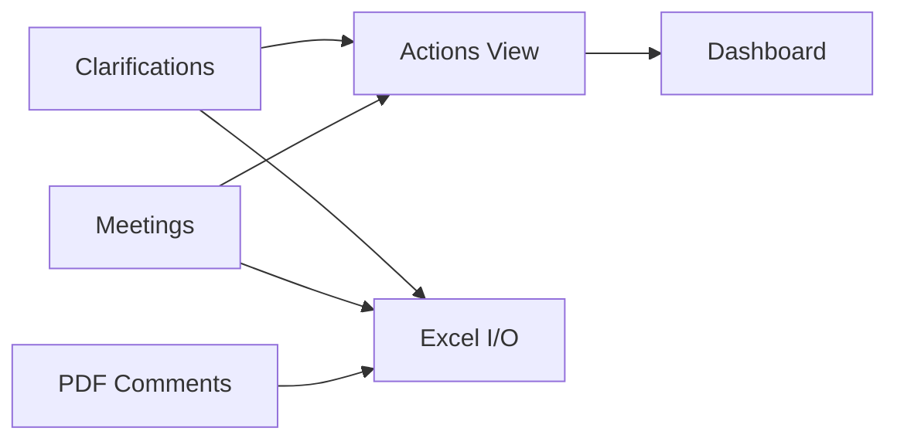
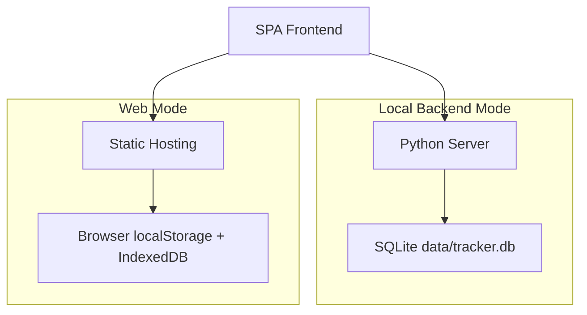

# Clarification Action Tracker System（中文）

[](README.md)
[](README.zh-CN.md)

[](./index.html)
[](./README.zh-CN.md#运行模式)
[](./README.zh-CN.md#架构速览)
[](./README.zh-CN.md)

[](https://vercel.com/new/clone?repository-url=https://github.com/XFKI/3.-Clarification_action_tracker_system)
[](https://github.com/XFKI/3.-Clarification_action_tracker_system/actions/workflows/github-pages-deploy.yml)

面向 FLNG/FPSO EPC 设备采购设计阶段的轻量跟踪系统。
将技术澄清与会议记录转化为可执行行动、风险可视化与可导出汇报数据。

## 价值定位

- 更快录入：结构化澄清和会议记录
- 更快跟踪：自动聚合未关闭行动并标识到期/逾期
- 更快闭环：在行动视图推进状态并回写源记录
- 更快复盘：仪表盘指标 + Excel 导入导出

## 架构速览





## 技术栈

| 层级 | 选型 | 价值 |
| --- | --- | --- |
| 前端 | HTML5 + CSS3 + Vanilla JavaScript | 轻量、可移植、部署简单 |
| 可视化 | Chart.js | 清晰展示 KPI 与趋势 |
| Excel | SheetJS (xlsx) | 贴合工程交付习惯 |
| 本地后端 | Python http.server | 受限办公环境中启动成本低 |
| 持久化 | SQLite | 单文件、可靠、易备份 |
| PDF 提取 | PyMuPDF | 工程批注提取实用 |
| 部署 | Vercel / GitHub Pages | 快速在线演示与分享 |

## 运行模式

### 本地后端模式（生产推荐）

- 数据与附件写入本地 SQLite
- Windows 启动：

```bat
quick-start.bat --serve 5500
```

- Linux/macOS 启动：

```bash
sh quick-start.sh 5500
```

### 网页模式（演示推荐）

- 无需本地 Python 进程
- 访问示例：

```text
https://<your-domain>/?mode=web
```

- 数据存储在浏览器侧，建议定期导出/备份

## 核心流程

1. 在 Clarifications 与 Meetings 录入源问题。
2. 在 Actions 按“逾期 -> 高优先级 -> 近期到期”推进。
3. 在 Dashboard 查看责任方负荷和关闭趋势。
4. 导出 Excel 做交付与归档。

## 核心功能

- 澄清与会议结构化管理
- 未关闭项自动聚合为 Actions
- 批量更新（状态、责任方、日期、优先级）
- 风险暴露（逾期、高优先级、责任方负荷）
- 审计元数据与历史追溯
- 回收站恢复
- 独立 PDF 意见看板
- 定时/手动备份机制

## 界面预览

截图位于 [docs/screenshots](docs/screenshots)。

### 1) 英文界面


### 2) 中文界面


### 3) 行动项视图


## 项目结构

```text
index.html
assets/
  css/styles.css
  js/app.core.js
  js/app.features.js
backend/
data/
docs/
  screenshots/
README.md
README.zh-CN.md
```

## 部署

### 一键部署

[](https://vercel.com/new/clone?repository-url=https://github.com/XFKI/3.-Clarification_action_tracker_system)
[](https://github.com/XFKI/3.-Clarification_action_tracker_system/actions/workflows/github-pages-deploy.yml)

### Vercel

1. 导入仓库到 Vercel。
2. Framework 选择 Other。
3. Build Command 留空。
4. 从根目录部署，访问时加 ?mode=web。

### GitHub Pages

- 使用仓库工作流 [.github/workflows/github-pages-deploy.yml](.github/workflows/github-pages-deploy.yml)
- 部署后访问地址追加 ?mode=web

## 验证清单

- 本地后端模式可正常启动
- 网页模式 ?mode=web 可正常启动
- Clarification/Meeting -> Action 聚合正确
- Dashboard 指标与图表正常
- Excel 导入导出正常
- 目标浏览器备份动作正常

## 说明

- 文件管理看板目前临时下线，不影响主流程。
- 当前状态值：OPEN / IN_PROGRESS / INFO / CLOSED。
- 长期目标状态仍为 OPEN / IN_PROGRESS / CLOSED。
