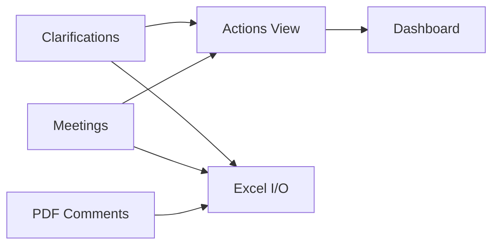
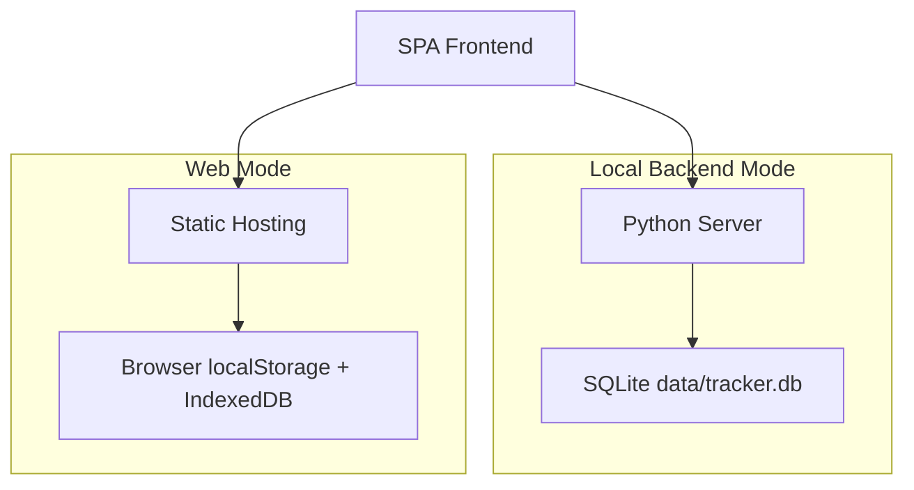

<div align="center">

# Clarification Action Tracker System

**工程闭环追踪台（原：工程澄清与行动追踪系统） · FLNG/FPSO EPC**

[](README.md)
[](README.zh-CN.md)

[](https://vercel.com/new/clone?repository-url=https://github.com/XFKI/3.-Clarification_action_tracker_system)
[](https://github.com/XFKI/3.-Clarification_action_tracker_system/actions/workflows/github-pages-deploy.yml)


</div>

面向 FLNG/FPSO EPC 采购设计阶段的轻量工程效率工具。
将技术澄清与会议记录转化为可执行行动、风险可视化与可导出汇报数据。

---

## 核心能力

| 模块 | 价值 |
| --- | --- |
| 结构化录入 | 澄清/会议行内编辑与关键字段校验 |
| 行动聚合 | 自动汇总未关闭项并支持回写源记录 |
| 风险暴露 | 逾期、高优先级、责任方负荷、临近到期 |
| 仪表盘 | KPI 卡片 + Chart.js 趋势图 |
| Excel I/O | SheetJS 双向导入导出 |
| PDF 意见 | PDF 批注提取、筛选、导出 |
| 审计追踪 | 变更历史 + 回收站恢复 |

## 技术栈

### 技术图标速览

- 🌐 前端：HTML5 + CSS3 + Vanilla JavaScript (ES6)
- 📈 可视化：Chart.js
- 📄 Excel 引擎：SheetJS (xlsx)
- 🐍 本地服务：Python 3 + http.server
- 🗄️ 数据存储：SQLite
- 🧾 PDF 提取：PyMuPDF
- 🚀 在线部署：Vercel + GitHub Pages

### 技术分层

| 层级 | 技术 | 作用 |
| --- | --- | --- |
| UI | Vanilla JS, HTML5, CSS3 | 轻量 SPA 交互 |
| 图表 | Chart.js | KPI 与趋势可视化 |
| 数据交换 | SheetJS | Excel 导入导出 |
| 本地服务 | Python http.server | 本地后端接口 |
| 持久化 | SQLite | 单文件可靠存储 |
| PDF 提取 | PyMuPDF | PDF 批注解析 |
| 在线交付 | Vercel, GitHub Pages | 在线演示部署 |

## 系统架构





## 运行模式

### 1) 本地后端模式（推荐）

```bat
quick-start.bat --serve 5500
```

```bat
quick-start.bat --diagnose --serve 5500
```

- 数据与附件写入本机 SQLite。
- `--diagnose` 会保留可见后端窗口，并将启动日志写入 `logs/backend-start-*.log`。
- 启动后会先进行 `/api/health` 检查，失败时给出明确提示：
  - 端口被其他进程占用
  - Python 运行环境缺失
  - 进程启动被终端安全策略拦截
- 停止后端：

```bat
quick-stop.bat 5500
```

### 本地备份与便携包

```bat
quick-backup-db.bat
```

```bat
quick-portable-package.bat
```

- `quick-backup-db.bat`：一键备份 `data/tracker.db` 到 `portable-backups/`。
- `quick-portable-package.bat`：在 `portable-package/` 生成标准化便携 ZIP 包，打包过程使用临时目录，不再在仓库中长期保留镜像工程目录。
- 默认不包含 `.venv`（提升跨电脑兼容性）；仅在同机使用时建议 `--with-venv`。
- 如需排查打包问题，可加 `--keep-stage` 保留临时构建目录。
- 如确需带 `.venv`，使用 `quick-portable-package.bat --with-venv`（仅建议同一台电脑使用）。
- 迁移规则：**复制数据库文件即可**。
  - 来源：`data/tracker.db`（或 `portable-backups/tracker-*.db`）
  - 目标：替换目标电脑上的 `data/tracker.db`

> 若日志出现 `did not find executable at 'D:\python\python.exe'`，说明复制过去的 `.venv` 已失效。
> 可直接运行 `set QUICK_START_SKIP_VENV=1 && quick-start.bat --serve 5500`，让启动脚本自动回退到系统 Python。

### Python EXE 单文件运行包

```bat
build-pythonexe.bat
```

```bat
quick-package-exe.bat
```

- `build-pythonexe.bat`：使用 PyInstaller 构建 `dist/ClarificationActionTracker.exe`。
- `quick-package-exe.bat`：自动构建并打包为 `portable-package/ClarificationActionTracker-EXE-*.zip`，解压后双击 EXE 即可运行。

### 2) 网页模式（Vercel / GitHub Pages）

- Vercel 访问：

```text
https://<your-domain>.vercel.app/?mode=web
```

- GitHub Pages 访问：

```text
https://xfki.github.io/3.-Clarification_action_tracker_system/
```

- 网页模式使用浏览器存储，适合演示与受限设备。

## 部署方式

### 一键部署

[](https://vercel.com/new/clone?repository-url=https://github.com/XFKI/3.-Clarification_action_tracker_system)
[](https://github.com/XFKI/3.-Clarification_action_tracker_system/actions/workflows/github-pages-deploy.yml)

### 手动说明

1. Vercel：Framework 选 Other，Build Command 留空。
2. GitHub Pages：运行 `.github/workflows/github-pages-deploy.yml`。
3. Vercel 演示建议使用 `?mode=web`。

## 界面预览

### 1) 英文仪表盘


### 2) 中文仪表盘


### 3) 行动项视图


## 推荐工作流

1. 在 Clarifications / Meetings 录入问题。
2. 在 Actions 按“逾期 -> 高优先级 -> 近期到期”推进。
3. 在 Dashboard 查看责任方风险与负荷。
4. 导出 Excel 做周报与归档。

## 90 秒快速上手

1. 先在总看板看跨项目风险，再切换到目标项目。
2. 在项目目录直接查看所有项目下设备包，快速做横向对比。
3. 技术问题录入技术澄清、会议任务录入会议纪要。
4. 在行动项里先处理逾期与高优先级。
5. 下班前点击一次“立即备份”，确保当天数据可恢复。

## 关键交互口径（2026-04）

1. 侧栏 `General` 仅保留总看板（Overview），用于查看全部项目与设备包聚合风险。
2. 项目目录下展示该项目设备包；进入项目后保留原有澄清/会议/行动项布局。
3. 各看板筛选口径统一（状态、责任方、专业等），但筛选状态互不干扰。
4. 新增意见为草稿，只有点击“保存”后才会持久化。
5. 定时备份必须先手动选择备份位置，并受“每日写入次数上限”约束，避免后台持续写入。
6. 筛选下拉（专业、责任方）采用“默认字典 + 现有数据并集”生成，并在后端同步后重建，避免出现空下拉。
7. 左侧项目目录默认展示所有项目的设备包；切换项目/设备包后主区看板即时联动。
8. 总看板布局口径：风险色块置顶；下方为“项目与设备包总览（自适应高度）+ 快捷入口（右侧紧凑）”；并新增“闭环效率快照 + 到期周负荷 Top8”。

## Power BI 化看板优化建议（可直接落地）

1. 数据填写口径统一：
  - `OPEN / IN_PROGRESS / CLOSED` 为主状态。
  - 每条记录尽量填写责任方、优先级、计划日期。
2. 闭环效率口径：
  - 统计对象：技术澄清 + 会议纪要。
  - 关键指标：7天关闭率、平均关闭天数、来源关闭率。
3. 风险暴露口径：
  - 责任方风险分 = 未关闭 + 2×逾期 + 2×高优先级。
  - 增加“到期周负荷 Top8”做周计划与资源平衡。
4. 展示建议：
  - 总看板用于“快速决策”，保持高密度卡片 + Top 表格。
  - 仪表盘用于“趋势分析”，关注老化分布、7日新增/关闭趋势与来源效率。

## 项目结构

```text
index.html
assets/
  css/styles.css
  js/app.core.js
  js/app.features.js
backend/
data/
docs/
  screenshots/
README.md
README.zh-CN.md
```

## 说明

- 文件管理看板目前临时下线，不影响主流程。
- 当前状态值：OPEN / IN_PROGRESS / INFO / CLOSED。
- 长期统一目标：OPEN / IN_PROGRESS / CLOSED。
