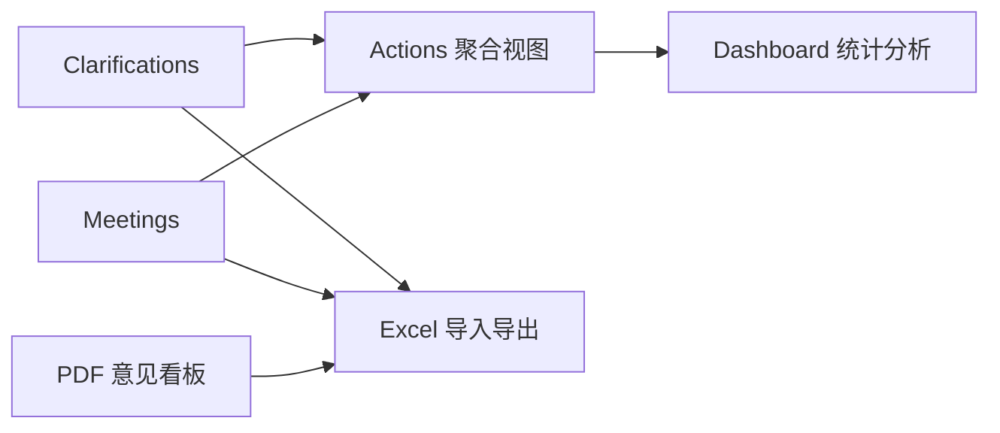
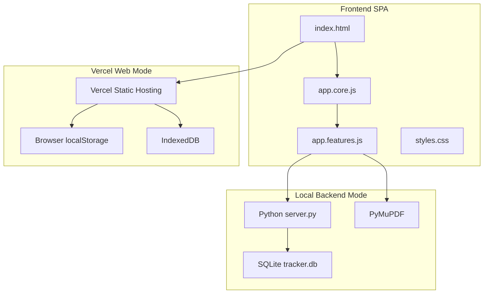
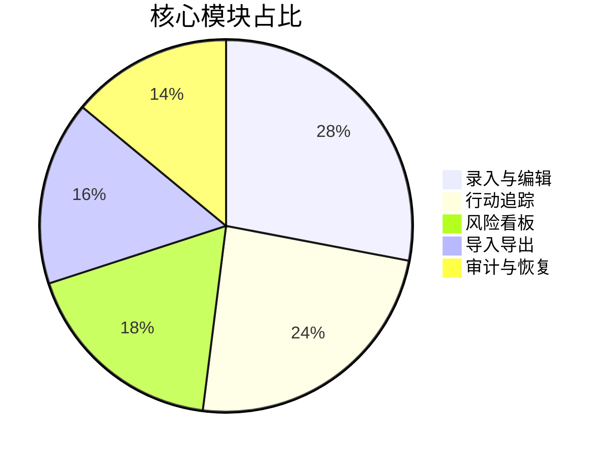

# Clarification Action Tracker System（中文详细文档）

[🏠 返回主页](README.md) &nbsp;|&nbsp; [🇬🇧 English](README.en.md)

面向 FLNG/FPSO EPC 设备采购设计阶段的个人效率系统，用于技术澄清、会议行动、风险暴露与问题闭环。

## 项目亮点（简历可直接引用）

- 业务闭环完整：录入 -> 聚合 -> 跟踪 -> 复盘。
- 架构轻量稳健：SPA + Python + SQLite，低维护、高可移植。
- 双运行模式：本地后端生产模式 + Vercel 网页演示模式。
- 工程可解释：状态归一化、批量更新、审计历史、回收站恢复。

## 系统全景图



## 技术架构图



## 功能构成图



## 1. 技术栈（进阶版）

| 层级 | 选型 | 作用 | 选型理由 |
| --- | --- | --- | --- |
| 交互层 | Vanilla JavaScript (ES6) | 表格编辑、状态管理、快捷键 | 零框架依赖，部署轻，便于离线/内网环境 |
| 可视化层 | Chart.js | KPI、状态分布、风险趋势 | 轻量且足够表达工程统计 |
| 数据交换 | SheetJS (xlsx) | Excel 双向导入导出 | 与工程团队现有交付习惯兼容 |
| 本地服务层 | Python http.server | API、文件处理、状态同步 | 可执行成本低，便于 Windows 批处理启动 |
| 数据持久层 | SQLite | 结构化记录、附件元数据 | 单文件数据库，备份与迁移简单 |
| 文档提取层 | PyMuPDF | PDF 注释抽取 | 工程图纸批注提取稳定、速度快 |
| 部署层 | Vercel Static Hosting | 在线演示访问 | 可绕过部分企业设备本地进程限制 |

## 2. 核心能力

- 澄清/会议结构化录入与行内编辑
- Actions 自动聚合未关闭项并回写源记录
- 逾期、高优先级、责任方负荷风险暴露
- 批量状态/责任方/日期/优先级更新
- 审计历史与回收站恢复
- PDF 意见独立看板（导入、筛选、勾选导出）

说明：文件管理看板当前临时下线，不影响主闭环流程。

## 3. 运行模式

### 3.1 本地后端模式（生产推荐）

- 数据位置：本机 SQLite（data/tracker.db）
- 启动命令（Windows）：quick-start.bat --serve 5500
- 启动命令（Linux/macOS）：sh quick-start.sh 5500

### 3.2 Vercel 网页模式（演示推荐）

- 数据位置：浏览器 localStorage + IndexedDB
- 访问方式：部署域名后追加 ?mode=web
- 示例：<https://your-project.vercel.app/?mode=web>

注意：网页模式适合演示与受限环境，不建议作为唯一生产数据源。

## 4. Vercel 一键部署（含排错）

### 4.1 控制台部署（最稳）

1. 打开 Vercel 控制台，选择 Add New Project。
2. 选择仓库：XFKI/3.-Clarification_action_tracker_system。
3. Framework 选 Other，Build Command 留空。
4. Root 选仓库根目录，直接 Deploy。
5. 访问：<https://你的域名/?mode=web>。

### 4.2 CLI 部署

1. 首次登录：npx vercel login
2. 生产部署：npx vercel --prod --yes

也可直接使用仓库一键脚本（Linux / macOS / Git Bash）：

- sh quick-deploy-vercel.sh

若出现 token 无效：

- 原因：本机 Vercel token 失效或未登录。
- 处理：重新执行 npx vercel login，或在 Vercel 个人设置生成新 token 后再部署。

## 5. 项目结构

```text
index.html
assets/
  css/styles.css
  js/app.core.js
  js/app.features.js
backend/
data/
docs/
README.md
README.zh-CN.md
README.en.md
.vercelignore
vercel.json
.gitignore
```

## 6. 简历描述建议

- 设计并实现 EPC 设备采购场景下的澄清与行动追踪系统，覆盖录入、聚合、推进、复盘全流程。
- 采用 Vanilla JS + Python + SQLite 轻量架构，实现批量操作、风险可视化、审计追踪与 Excel 双向集成。
- 设计双模式运行策略：本地后端保障数据可靠性，Vercel 网页模式满足企业受限设备的在线访问需求。
